<div align="center">

# 🐳 MySQL Docker Replication

[](https://github.com/mohamedhabibwork/mysql-docker-replication/actions)
[](https://github.com/mohamedhabibwork/mysql-docker-replication/actions)
[](https://opensource.org/licenses/MIT)
[](https://hub.docker.com/_/mysql)
[](https://docs.docker.com/get-docker/)

**Production-ready MySQL 8.0 master/replica replication setup with Docker Compose**

*Quick setup • SSL/TLS encryption • Automated management • Local & remote deployment*

[Quick Start](#-quick-start) • [Documentation](#-documentation) • [Examples](#-examples) • [Contributing](#-contributing)

</div>

---

## 🚀 Features

<table>
<tr>
<td>

**🏗️ Architecture**
- Master/Replica topology
- MySQL 8.0 containers
- Docker Compose orchestration
- Persistent data volumes
- Health monitoring

</td>
<td>

**🔐 Security**
- SSL/TLS encryption
- Self-signed certificates
- Secure replication
- Read-only replica
- Password protection

</td>
</tr>
<tr>
<td>

**⚙️ Management**
- Single command operations
- Automated setup
- Permission handling
- Log aggregation
- Status monitoring

</td>
<td>

**🌐 Deployment**
- Local development
- Remote replication
- Environment-driven config
- Cross-platform support
- CI/CD ready

</td>
</tr>
</table>

## 📋 Prerequisites

| Requirement | Version | Installation |
|-------------|---------|--------------|
| **Docker Engine** | 20.10+ | [Get Docker](https://docs.docker.com/get-docker/) |
| **Docker Compose** | v2.0+ | [Install Compose](https://docs.docker.com/compose/install/) |
| **Bash** | 4.0+ | Pre-installed on most systems |
| **OpenSSL** | Any | `brew install openssl` / `apt install openssl` |

## ⚡ Quick Start

```bash
# 1. Clone the repository
git clone https://github.com/mohamedhabibwork/mysql-docker-replication.git
cd mysql-docker-replication

# 2. Setup environment files
cp master/.env.example master/.env
cp replica/.env.example replica/.env
# Edit .env files with your passwords and settings

# 3. Generate SSL certificates (optional)
./mange.sh generate-certs

# 4. Start the replication topology
./mange.sh start

# 5. Verify replication is working
./mange.sh status
```

**🎉 That's it! Your MySQL replication is ready.**

Access your databases:
- **Master**: `localhost:3308`
- **Replica**: `localhost:3309`

## 🏗️ Architecture Overview

```mermaid
graph TB
    subgraph "Docker Host"
        subgraph "Master Container"
            M[MySQL Master<br/>Port: 3308<br/>Server ID: 1]
            MV[(Data Volume)]
            ML[(Log Volume)]
            M --- MV
            M --- ML
        end
        
        subgraph "Replica Container"
            R[MySQL Replica<br/>Port: 3309<br/>Server ID: 2<br/>Read-Only]
            RV[(Data Volume)]
            RL[(Log Volume)]
            R --- RV
            R --- RL
        end
        
        subgraph "SSL Certificates"
            SSL[ca-cert.pem<br/>server-cert.pem<br/>client-cert.pem]
        end
        
        M -.->|"Binlog Replication<br/>(SSL Encrypted)"| R
        SSL -.-> M
        SSL -.-> R
    end
    
    subgraph "External Access"
        APP1[Application<br/>Read/Write]
        APP2[Application<br/>Read Only]
    end
    
    APP1 --> M
    APP2 --> R
```



## 📁 Repository Structure

```
mysql-docker-replication/
├── 📄 mange.sh                     # Main management script
├── 🔧 generate-ssl-certs.sh       # SSL certificate generator
├── 📂 master/
│   ├── 🐳 docker-compose.yml       # Master container config
│   ├── ⚙️ master.cnf               # MySQL master configuration
│   ├── 📝 .env.example             # Environment template
│   ├── 💾 data/                    # MySQL data (auto-created)
│   └── 📋 logs/                    # MySQL logs (auto-created)
├── 📂 replica/
│   ├── 🐳 docker-compose.yml       # Replica container config
│   ├── ⚙️ replica.cnf              # MySQL replica configuration
│   ├── 📝 .env.example             # Environment template
│   ├── 💾 data/                    # MySQL data (auto-created)
│   └── 📋 logs/                    # MySQL logs (auto-created)
├── 🔐 ssl-certs/                   # SSL certificates (generated)
├── 📚 docs/                        # Comprehensive documentation
├── 🔧 .github/                     # GitHub workflows & templates
└── 📖 README.md                    # This file
```

## 🎮 Management Commands

| Command | Description | Example |
|---------|-------------|---------|
| `start` | 🚀 Bootstrap environment and start replication | `./mange.sh start` |
| `stop` | ⏹️ Stop all containers gracefully | `./mange.sh stop` |
| `status` | 📊 Show master/replica status | `./mange.sh status` |
| `logs` | 📋 Follow container logs | `./mange.sh logs master` |
| `reset` | 🔄 Reset all data (⚠️ destructive) | `./mange.sh reset` |
| `generate-certs` | 🔐 Generate SSL certificates | `./mange.sh generate-certs` |
| `fix-permissions` | 🔧 Fix file permissions | `./mange.sh fix-permissions` |

<details>
<summary><strong>🔍 View detailed command output examples</strong></summary>

```bash
$ ./mange.sh status
[INFO] Master Status:
*************************** 1. row ***************************
             File: mysql-bin.000001
         Position: 1234
     Binlog_Do_DB: 
 Binlog_Ignore_DB: 
Executed_Gtid_Set: 

[INFO] Replica Status:
*************************** 1. row ***************************
               Slave_IO_State: Waiting for master to send event
                  Master_Host: mysql-master
                  Master_User: repl
                  Master_Port: 3306
             Slave_IO_Running: Yes
            Slave_SQL_Running: Yes
```

</details>

## 🔧 Configuration

### Environment Variables

Create and customize your `.env` files:

<details>
<summary><strong>📝 Master Configuration (.env)</strong></summary>

```bash
# MySQL Master Configuration
MYSQL_ROOT_PASSWORD=your_secure_password
MYSQL_DATABASE=myapp
MYSQL_USER=appuser
MYSQL_PASSWORD=your_app_password

# Replication User
MYSQL_REPLICATION_USER=repl
MYSQL_REPLICATION_PASSWORD=your_replication_password

# Container Settings
CONTAINER_NAME=mysql-master
HOST_PORT=3308
SERVER_ID=1

# Volumes
DATA_DIR=./data
LOGS_DIR=./logs

# Security
SSL_ENABLED=true
```

</details>

<details>
<summary><strong>📝 Replica Configuration (.env)</strong></summary>

```bash
# MySQL Replica Configuration
MYSQL_ROOT_PASSWORD=your_secure_password  # Must match master
MYSQL_DATABASE=myapp
MYSQL_USER=appuser
MYSQL_PASSWORD=your_app_password

# Master Connection
MASTER_HOST=mysql-master  # For same host deployment
MYSQL_REPLICATION_USER=repl
MYSQL_REPLICATION_PASSWORD=your_replication_password

# Container Settings
CONTAINER_NAME=mysql-replica
HOST_PORT=3309
SERVER_ID=2

# Volumes
DATA_DIR=./data
LOGS_DIR=./logs

# Security
SSL_ENABLED=true
```

</details>

### Deployment Scenarios

<table>
<tr>
<th>🏠 Local Development</th>
<th>🌐 Remote Replication</th>
</tr>
<tr>
<td>

```bash
# Master .env
MASTER_HOST_IP=

# Replica .env
MASTER_HOST=mysql-master
```

</td>
<td>

```bash
# Master .env
MASTER_HOST_IP=10.10.0.100

# Replica .env
MASTER_HOST=10.10.0.100
```

</td>
</tr>
</table>

## 🔐 SSL/TLS Security

### Automatic Certificate Generation

```bash
# Generate self-signed certificates
./mange.sh generate-certs
```

This creates:
- `ca-cert.pem` / `ca-key.pem` - Certificate Authority
- `server-cert.pem` / `server-key.pem` - Master server certificates
- `client-cert.pem` / `client-key.pem` - Replica client certificates

### Manual Certificate Installation

```bash
# Place your certificates in ssl-certs/
cp your-ca.pem ssl-certs/ca-cert.pem
cp your-server.pem ssl-certs/server-cert.pem
cp your-client.pem ssl-certs/client-cert.pem
# ... (keys as well)

# Set proper permissions
chmod 644 ssl-certs/*.pem
chmod 600 ssl-certs/*-key.pem
```

## 🧪 Testing & Validation

### Automated Testing

Our CI/CD pipeline automatically tests:

- ✅ Container startup and health checks
- ✅ Replication configuration
- ✅ Data synchronization
- ✅ SSL/TLS encryption
- ✅ Read-only replica enforcement

### Manual Testing

```bash
# Test data replication
docker exec mysql-master mysql -u root -p -e "
  CREATE DATABASE test_db;
  USE test_db;
  CREATE TABLE users (id INT PRIMARY KEY, name VARCHAR(50));
  INSERT INTO users VALUES (1, 'Alice'), (2, 'Bob');
"

# Verify on replica
docker exec mysql-replica mysql -u root -p -e "
  USE test_db;
  SELECT * FROM users;
"

# Test read-only enforcement (should fail)
docker exec mysql-replica mysql -u root -p -e "
  USE test_db;
  INSERT INTO users VALUES (3, 'Charlie');
"
```

## 📊 Monitoring & Observability

### Health Checks

Each container includes built-in health monitoring:

```yaml
healthcheck:
  test: ["CMD", "mysqladmin", "ping", "-h", "localhost"]
  timeout: 20s
  retries: 10
```

### Log Analysis

```bash
# Monitor real-time logs
./mange.sh logs master   # Master logs
./mange.sh logs replica  # Replica logs

# Check specific log files
docker exec mysql-master tail -f /var/log/mysql/error.log
```

### Performance Metrics

```sql
-- Check replication lag
SHOW SLAVE STATUS\G

-- Monitor binary log position
SHOW MASTER STATUS\G

-- View process list
SHOW PROCESSLIST;
```

## 🎯 Use Cases

<table>
<tr>
<td width="50%">

### 🏗️ **Development & Testing**
- Local MySQL replication setup
- CI/CD pipeline testing
- Application development
- Database schema changes
- Load testing scenarios

</td>
<td width="50%">

### 🏭 **Production Patterns**
- Read/write splitting
- Load distribution
- Backup strategies
- Disaster recovery
- High availability setup

</td>
</tr>
</table>

## 📚 Documentation

| Document | Description |
|----------|-------------|
| [🔧 Environment Setup](docs/environment.md) | Detailed configuration guide |
| [⚙️ Operations Guide](docs/operations.md) | Day-to-day management |
| [🔐 SSL Configuration](docs/ssl.md) | Certificate management |
| [🩺 Troubleshooting](docs/troubleshooting.md) | Common issues & solutions |

## 🔧 Advanced Usage

<details>
<summary><strong>🔄 Adding Multiple Replicas</strong></summary>

```bash
# 1. Copy replica directory
cp -r replica/ replica-2/

# 2. Update configuration
sed -i 's/mysql-replica/mysql-replica-2/g' replica-2/.env
sed -i 's/3309/3310/g' replica-2/.env
sed -i 's/SERVER_ID=2/SERVER_ID=3/g' replica-2/.env

# 3. Start additional replica
cd replica-2 && docker-compose up -d
```

</details>

<details>
<summary><strong>🔄 Custom MySQL Configuration</strong></summary>

```bash
# Edit MySQL configuration files
vim master/master.cnf
vim replica/replica.cnf

# Restart containers to apply changes
./mange.sh stop && ./mange.sh start
```

</details>

<details>
<summary><strong>🔄 Backup & Restore</strong></summary>

```bash
# Create backup
docker exec mysql-master mysqldump -u root -p --all-databases > backup.sql

# Restore backup
docker exec -i mysql-master mysql -u root -p < backup.sql
```

</details>

## 🚨 Troubleshooting

<details>
<summary><strong>🔍 Common Issues</strong></summary>

| Issue | Solution |
|-------|----------|
| **Permission denied** | Run `./mange.sh fix-permissions` |
| **Container won't start** | Check port conflicts with `docker ps` |
| **Replication not working** | Verify `.env` files match |
| **SSL errors** | Regenerate certificates with `./mange.sh generate-certs` |

</details>

<details>
<summary><strong>🔍 Debug Commands</strong></summary>

```bash
# Check container status
docker ps -a

# View detailed logs
docker logs mysql-master --details

# Test connectivity
docker exec mysql-replica ping mysql-master

# Validate SSL
docker exec mysql-master mysql -e "SHOW VARIABLES LIKE 'have_ssl';"
```

</details>

## 🤝 Contributing

We welcome contributions! Here's how to get started:

1. 🍴 Fork the repository
2. 🌟 Create a feature branch (`git checkout -b feature/amazing-feature`)
3. 💾 Commit your changes (`git commit -m 'Add amazing feature'`)
4. 📤 Push to the branch (`git push origin feature/amazing-feature`)
5. 🔄 Open a Pull Request

Please see our [Contributing Guide](CONTRIBUTING.md) for detailed information.

### Development Setup

```bash
# Clone your fork
git clone https://github.com/your-username/mysql-docker-replication.git
cd mysql-docker-replication

# Install development tools
brew install shellcheck  # For script linting

# Run tests
./mange.sh start
./mange.sh status
./mange.sh stop
```

## 📈 Project Stats


## 📄 License

This project is licensed under the MIT License - see the [LICENSE](LICENSE) file for details.

---

<div align="center">

**Made with ❤️ by [Mohamed Habib](https://github.com/mohamedhabibwork)**

[⭐ Star this repository](https://github.com/mohamedhabibwork/mysql-docker-replication/stargazers) if you find it helpful!

</div>
